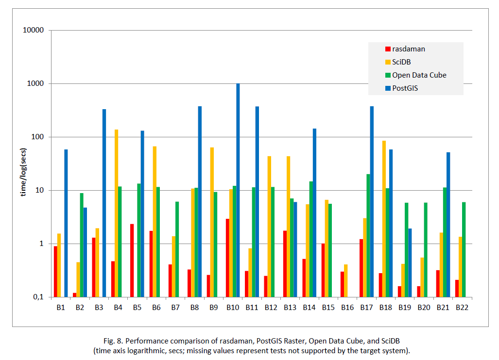

# RasBench
This repository hosts rasdaman benchmarks and benchmark results. It is complimentary to the "Array Databases: Concepts, Standards, Implementations" [report] and relates specifically to **Chapter 7.6 Performance Comparison**.

# Systems Tested

Benchmark tests included in this repository measure various functionalities, data sizings, and also the effect of parallelization. Four systems have been measured:

  - rasdaman v9.5
  - SciDB 16.9
  - PostGIS Raster 2.4.1 (all GDAL drivers enabled) on top of PostgreSQL 9.6.6
  - Open Data Cube 1.5.4

These represent three Array DBMSs with different implementation paradigms; hence, the choice can be considered representative for the field. Open Data Cue was chosen as a representative of array tools based on scripting languages. Not present are MapReduce-type systems, due to resource constraints – this is left for future investigation.

# Machine Used

The machine on which the benchmark has been evaluated has the following characteristics:

* OS: Ubuntu 14.04
* CPU: Intel Xeon E5-2609v3 @ 1.90GHz; 2x 6-core CPUs, 16MB L3 cache, 256kB L2, 32kB L1
* RAM: 64GB DDR4 2133MHz
* Disk: SSD, read speed 520 MB/sec

# Testing approach

The approach followed is based on and extends current literature on array database benchmarking. ance factors can be distinguished, the most important being: storage access, array-generating operat-ions, and aggregation operations. Following these categories we have established a series of test situat-ions that can be translated directly into queries in case of Array Databases, and which need to be pro-grammed via command line, python, or C++ code for the other tools. For each category several different types of queries have been devised:

* Binary operations combining two arrays, such as “a+b”. Which binary operator this is can be considered of less importance here – we randomly chose addition. The queries cover different array dimensions and array operands with both matching and mismatching tiles.
* Binary operations applying some scalar to an array, like “a+5”; again, we chose addition as the representative tested.
* Domain-modifying operations which do not change the array values as such, like shift, extend, and band combination (e.g., combining three images into a 3-band RGB).
* Subsetting operations involving slicing, trimming, and mixed on 2-D and 3-D arrays. While sub-setting is also a domain modifying operation we put it in its own category due to its importance and versatility.
* Unary operations like sine calculation, type casting, and array aggregation.
* “Blocking” operations which require materializing the whole array before they can be evaluated.
* The CASE statement and concatenation are somewhat special operations that do not fit well in the other categories.

Each query class in turn has several variations differing in the size of the arrays involved (40 kB - 4 GB), number of tiles per array (1 – 10,000 tiles), the size of the output array, etc. A complete table with the queries used can be found on pages 63-64 of the [report].

# Systems Tested

Benchmark tests included in this repository measure various functionalities, data sizings, and also the effect of parallelization. Four systems have been measured:

  - rasdaman v9.5
  - SciDB 16.9
  - PostGIS Raster 2.4.1 (all GDAL drivers enabled) on top of PostgreSQL 9.6.6
  - Open Data Cube 1.5.4

These represent three Array DBMSs with different implementation paradigms; hence, the choice can be considered representative for the field. Open Data Cue was chosen as a representative of array tools based on scripting languages. Not present are MapReduce-type systems, due to resource constraints – this is left for future investigation.

# Machine Used

The machine on which the benchmark has been evaluated has the following characteristics:

* OS: Ubuntu 14.04
* CPU: Intel Xeon E5-2609v3 @ 1.90GHz; 2x 6-core CPUs, 16MB L3 cache, 256kB L2, 32kB L1
* RAM: 64GB DDR4 2133MHz
* Disk: SSD, read speed 520 MB/sec

# Tested queries

* Note: **<system_name>** placeholder corresponds to one of the following systems:
  * rasdaman v9.5
  * SciDB 16.9
  * PostGIS Raster 2.4.1 (all GDAL drivers enabled) on top of PostgreSQL 9.6.6
  * Open Data Cube 1.5.4

| ID | Description | Query | Benchmark Folder | Benchmark Results |
| -- | ----------- | ----- | ---------------- | ----------------- |
| B1 | Sum of the array’s elements | MDSUM\(c\) | /benchmark/**<system_name>**/aggregation | /results/benchy.**<system_name>**.<suffix>/aggregation |
| B2 | For each element in an array the result element is 1 if its value is 0, otherwise the result is the common logarithm of its value | CASE WHEN c = 0 THEN 1 ELSE LOG10\(c\) END | /benchmark/**<system_name>**/case_log | /results/benchy.**<system_name>**.<suffix>/case_log |
| B3 | Cast all elements to unsigned 8-bit values | MDCAST\(c AS char\) | /benchmark/**<system_name>**/cast | /results/benchy.**<system_name>**.<suffix>/cast |
| B4 | Concatenate two arrays along the first axis | MDCONCAT\(c, c, 1\) | /benchmark/**<system_name>**/concat | /results/benchy.**<system_name>**.<suffix>/concat |
| B5 | Encode an array to TIFF | MDENCODE\(c, "image/tiff"\) | /benchmark/**<system_name>**/encode | /results/benchy.**<system_name>**.<suffix>/encode |
| B6 | Extend the spatial domain of an array to twice its width and height | MDRESHAPE\(c, [ 0:MDAXIS HI\(c,x\)*2, 0:MDAXIS HI\(c,y\)*2 ] ) | /benchmark/**<system_name>**/extend | /results/benchy.**<system_name>**.<suffix>/extend |
| B7 | Add two 1-D arrays with mismatching tiles | c + d | /benchmark/**<system_name>**/plus_1d_array_array_mismatching | /results/benchy.**<system_name>**.<suffix>/plus_1d_array_array_mismatching |
| B8 | Add two 2-D arrays with matching tiles | c + c | /benchmark/**<system_name>**/plus_2d_array_array | /results/benchy.**<system_name>**.<suffix>/plus_2d_array_array |
| B9 | Add two 2-D arrays with mismatching tiles | c + d | /benchmark/**<system_name>**/plus_2d_array_array_mismatching | /results/benchy.**<system_name>**.<suffix>/plus_2d_array_array_mismatching |
| B10 | Add the average value of an array to all of its elements | c + MDAVG\(c\) | /benchmark/**<system_name>**/plus_2d_array_avg | /results/benchy.**<system_name>**.<suffix>/plus_2d_array_avg |
| B11 | Add a constant scalar value to all elements of an array | c + 4 | /benchmark/**<system_name>**/plus_2d_array_scalar | /results/benchy.**<system_name>**.<suffix>/plus_2d_array_scalar |
| B12 | Add two 3-D arrays with mismatching tiles | c + d | /benchmark/**<system_name>**/plus_3d_array_array_mismatching | /results/benchy.**<system_name>**.<suffix>/plus_3d_array_array_mismatching |
| B13 | Calculate all percentiles | MDQUANTILE\(c, 100\) | /benchmark/**<system_name>**/quantile | /results/benchy.**<system_name>**.<suffix>/quantile |
| B14 | Join several arrays into a single multi-band array | MDJOIN\( c, MDARRAY MDEXTENT\(c\) ELEMENTS 3, c \) | /benchmark/**<system_name>**/range_constructor | /results/benchy.**<system_name>**.<suffix>/range_constructor |
| B15 | Scale-up (2x) an array | MDSCALE\( c, [ MDAXIS LO\(c,x\) : MDAXIS HI\(c,x\)*2, MDAXIS LO\(c,y\) : MDAXIS HI\(c,y\)*2 ] \) | /benchmark/**<system_name>**/scale | /results/benchy.**<system_name>**.<suffix>/scale |
| B16 | Shift the spatial domain by a given shift coordinate | MDSHIFT\(c, [500, -1000]\) | /benchmark/**<system_name>**/shift | /results/benchy.**<system_name>**.<suffix>/shift |
| B17 | Calculate the sine of every element in an array | SIN\(c\) | /benchmark/**<system_name>**/sin | /results/benchy.**<system_name>**.<suffix>/sin |
| B18 | Subset the whole spatial domain | c[\*:\*,\*:\*] | /benchmark/**<system_name>**/subset_2d_all | /results/benchy.**<system_name>**.<suffix>/subset_2d_all |
| B19 | Select a single element at a particular coordinate | c[5, MDAXIS HI\(c,y\) - 5] | /benchmark/**<system_name>**/subset_2d_point | /results/benchy.**<system_name>**.<suffix>/subset_2d_point |
| B20 | Slice the first axis at a particular point | c[5, MDAXIS LO\(c,y\) + 3 : MDAXIS HI\(c,y\) – 3 ] | /benchmark/**<system_name>**/subset_2d_slice_dim1 | /results/benchy.**<system_name>**.<suffix>/subset_2d_slice_dim1 |
| B21 | Trim down both axes | c[ MDAXIS LO\(c,x\) + 3 : MDAXIS HI\(c,x\) - 3, MDAXIS LO\(c,y\) + 3 : MDAXIS HI\(c,y\) – 3 ] | /benchmark/**<system_name>**/subset_2d_trim | /results/benchy.**<system_name>**.<suffix>/subset_2d_trim |
| B22 | Slice the first axis of a 3-D array at a particular point | c[ MDAXIS HI\(c,z\), MDAXIS LO\(c,x\) + 3 : MDAXIS HI\(c,x\) - 3, MDAXIS LO\(c,y\) + 3 : MDAXIS HI\(c,y\) – 3 ] | /benchmark/**<system_name>**/subset_3d_slice_dim1 | /results/benchy.**<system_name>**.<suffix>/subset_3d_slice_dim1 |

# Assessment

As it turns out the technology landscape around Array Databases is quite varied, ranging from full-stack from-scratch implementations over object-relational DBMS add-ons to MapReduce add-ons, and all in between. In this line-up of 19 array tools many are natively designed as a service while some of them comprise command line tools or libraries which are not complete services, but may aid in developing services. Technologies were evaluated through a feature walk-through addressing functionality (logical model), tuning and optimization (physical level), and architecture; a comparative benchmark between selected systems.
Investigation, for resource reasons, could only cover storage access and “embarrassingly parallel” oper-ations; what is left for future research are operations whose parallelization is more involved, including general Linear Algebra and joins. Nevertheless, some interesting facts can be observed.
Overall, a clear ranking is visible with rasdaman being fastest, followed by Open Data Cube (up to 74x slower), PostGIS Raster (up to 82x slower), and SciDB (up to 304x slower), in sequence. For more information please refer to the [report].


Format: 

# Benchmark execution

The benchmarks are executed with benchy (https://github.com/misev/benchy). For example, to
execute the `polygon_clipping` benchmark suite and save the results in the
`polygon_clipping_results` directory:

```bash
benchy.sh -d polygon_clipping/ -r polygon_clipping_results/
```

To setup another benchmark the `benchmark.conf` and `datamanager.sh` from
`polygon_clipping` can be reused.

Refer to the documentation of benchy for further information.

[//]: # (These are reference links)
   [report]: <https://www.rd-alliance.org/system/files/Array-Databases_final-report.pdf>
